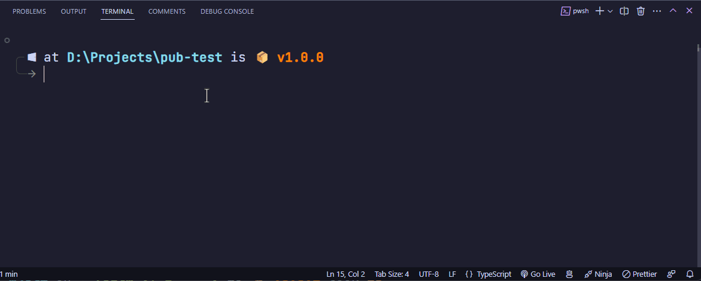

```sh
Usage: sern commands publish [options] [path]

New way to manage your slash commands

Arguments:
  path                          path with respect to current working directory that will locate all published files

Options:
  -i, --import [scriptPath...]  Prerequire a script to load into publisher
  -t, --token [token]
  --appId [applicationId]
  -h, --help                    display help for command
```
## Implicits
- Automatically reads a .env in the working directory. For seamless integration, your .env file should look like this:
```txt title=".env" 
DISCORD_TOKEN=<YOUR_TOKEN>
APPLICATION_ID=<YOUR_APPLICATION_ID>
MODE=<DEV|PROD>
```
- Calls the discord API with the [PUT route](https://discord.com/developers/docs/interactions/application-commands#bulk-overwrite-global-application-commands). Wherever your commands directory is located, publish will override the existing application commands at Discord. Existing commands do not count towards the command limit creation daily. 

You may pass these in as command line arguments as well. **CLI arguments take precedence.**
If you do not know how to obtain either of these credentials, [click here](https://github.com/reactiflux/discord-irc/wiki/Creating-a-discord-bot-&-getting-a-token)

## Usage 




## Features
- Automatically syncs api with your command base
- generates JSON file of output (**.sern/command-data-remote.json**)
- supports publishing direct esm typescript files
- commonjs users need to compile first and then run sern publish on the dist/ output
- prerequire scripts.
- supports a configuration that is the same as the original publish plugin.


Each command file can have an extra config that follows this typescript interface:
PermissionResolvable is a discord.js type, but it will accept anything that the discord API accepts

```ts 
interface ValidPublishOptions {
	guildIds: string[];
	dmPermission: boolean;
	defaultMemberPermissions: PermissionResolvable;
}

```
## Prerequiring 
Is there a [service](../guide/walkthrough/services) that is required at the top level of a command?
- Create an ES6 script anywhere: 

```ts title="scripts/prerequire.mjs"
import { makeDependencies, single, Service } from '@sern/handler'
import { Client } from 'discord.js'

await makeDependencies({
  build: (root) =>
    root.add({ "@sern/client": single(() => new Client(...options)) }),
});

await Service('@sern/client').login()
```
This will create a container for publishing. (as of 0.6.0, client is required or this will crash)

### Example: command published in guild

#### Script ran:
```
sern commands publish -i ./scripts/prerequire.mjs
```
```ts title=src/commands/ping.ts
import { commandModule, Service, CommandType } from '@sern/handler'

const client = Service('@sern/client');

export const config = { 
    guildIds: ["889026545715400705"]
}

export default commandModule( {
    type: CommandType.Slash
    description: `${client.user.username}'s ping`,
    execute: (ctx) => { 
        ctx.reply('pong')
    }
})

```
